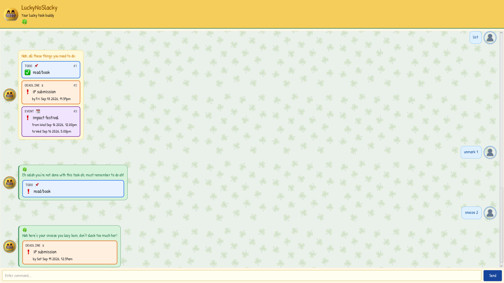
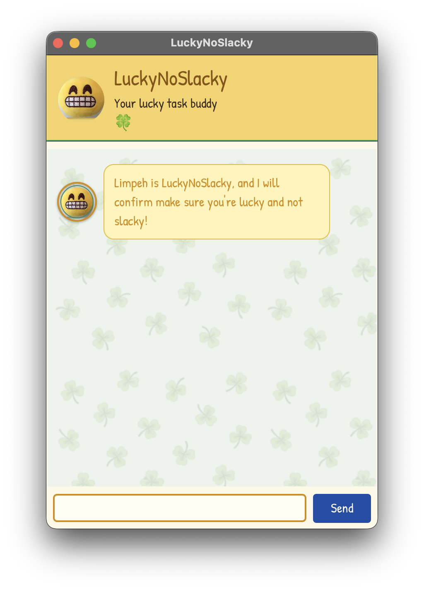

# LuckyNoSlacky User Guide

> Limpeh is LuckyNoSlacky, and I will confirm make sure you're lucky and not slacky!

Feeling like slacking and down on luck?
LuckyNoSlacky fixes both aspects with a uniquely Singaporean flair!



## Quick Start

LuckyNoSlacky requires Java 25. Run the released cross-platform JAR from the
directory where you want the `data/` folder to be created:

1. Ensure that Java 25 or later is installed on your computer.
   For mac users, ensure that you have this precise JDK version [here](https://se-education.org/guides/tutorials/javaInstallationMac.html)
2. Download the latest `luckyNoSlacky.jar` file from [my github page](https://github.com/Lol-Hi/ip/releases/tag/A-Release)
3. Copy the `luckyNoSlacky.jar` file to your desired home folder
4. Open your terminal, `cd` to the home folder containing `luckyNoSlacky.jar`, and run
```bash
$ java -jar luckyNoSlacky.jar
```
If all goes well, the window below should appear on your home screen:


## Using LuckyNoSlacky
Simply type a command in the command box and click `Send` or tap `Enter` to execute it.
The list of available commands are:
- Create Tasks:
  - [`todo`](#create-todo-tasks-todo)
  - [`deadline`](#create-deadline-tasks-deadline)
  - [`event`](#create-event-tasks-event)
- List all tasks: [`list`](#list-all-tasks-list)
- Finding tasks: [`find`](#find-tasks-by-description-or-date-find)
- Managing Tasks:
  - [`mark`](#mark-tasks-as-done-mark) and [`unmark`](#unmark-task-unmark)
  - [`snooze`](#delay-tasks-snooze)
  - [`resched`](#reschedule-tasks-resched)
- Deleting Tasks: [`delete`](#delete-tasks-delete)
- Exit the chat: [`bye`](#exit-bye)

### Create Todo Tasks: `todo`
Adds a *Todo* task.
A *Todo* task is a task with no associated date.
```text
todo <description>
```
- Extra whitespace before and after `description` is trimmed on parsing

Example: `todo read/book`
> Got one more thing to remember ah:
>
> ```text
>   [📌][❗] read/book
> ```
>
> Now you got 1 tasks to settle.

### Create Deadline Tasks: `deadline`
Adds a *deadline* task.
A *deadline* task is a task with a deadline `date/time`
```text
deadline <description> /by <date/time>
```
- Extra whitespace before and after `description` or `date/time` is trimmed on parsing
- As long as the entered `date/time` is not before the present day,
  it would be accepted if it is one of the many [accepted formats](#datetime-accepted-formats)

Example: `deadline iP Submission /by 18 Sep 2359`
> Got one more thing to remember ah:
>
> ```text
>   [⏳][❗] iP Submission (by Fri Sep 18 2026, 11.59pm)
> ```
>
> Now you got 2 tasks to settle.

### Create Event Tasks: `event`
Adds an *event* task.
An *event* task is a task with a `start date/time` and an `end date/time`.
```text
event <description> /from <start date/time> /to <end date/time>
```
- Extra whitespace before and after `description`, `start date/time` or `end date/time` is trimmed on parsing
- The entered `start date/time` must not occur after the `end date/time`,
  and the `end date/time` should not occur before the current day.
- Otherwise, the `date/time` arguments will be accepted if it is one of the many [accepted formats](#datetime-accepted-formats)

Example: `event Impact Festival /from 16 Sep 2026 12pm /to 5pm`
> Got one more thing to remember ah:
>
> ```text
>   [📆][❗] Impact Festival (from Wed Sep 16 2026, 12.00pm to Wed Sep 16 2026, 5.00pm)
> ```
>
> Now you got 3 tasks to settle.

### List All Tasks: `list`
Displays all the tasks saved in LuckyNoSlacky.
```text
list
```
Example: `list`
> Nah, all these things you need to do:
>
> ```text
>   1.[📌][❗] read/book
>   2.[⏳][❗] iP Submission (by Fri Sep 18 2026, 11.59pm)
>   3.[📆][❗] Impact Festival (from Wed Sep 16 2026, 12.00pm to Wed Sep 16 2026, 5.00pm)
> ```

### Find Tasks by Description or Date: `find`
Finds tasks in LuckyNoSlacky that matches the queried `description` or `date/time`.
```text
find <description>
find /on <date/time>
find <description> /on <date/time>
```
- Extra whitespace before and after `description` or `date/time` is trimmed on parsing
- The `description` query can merely be a substring of the actual description of the task
- `date/time` argument can be accepted if it is one of the many [accepted formats](#datetime-accepted-formats)

Example: `find iP`
> Nah, all these things you need to do:
>
> ```text
>   2.[⏳][❗] iP Submission (by Fri Sep 18 2026, 11.59pm)
> ```

Example: `find /on 16/09/2026`
> Nah, all these things you need to do on: Wed Sep 16 2026
>
> ```text
>   3.[📆][❗] Impact Festival (from Wed Sep 16 2026, 12.00pm to Wed Sep 16 2026, 5.00pm)
> ```

### Mark Tasks as Done: `mark`
Marks a specific task (specified by `task number`) as done.
```text
mark <task number>
```
- `task number` is based on the specific number shown beside the task when `list` is called

Example: `mark 1`
> Swee lah you're done with this task:
>
> ```text
>   [📌][✅] read/book
> ```

### Unmark Task: `unmark`
Marks a specific task (specified by `task number`) as not done yet.
```text
unmark <task number>
```
- `task number` is based on the specific number shown beside the task when `list` is called

Example: `unmark 1`
> Eh salah you're not done with this task ah, must remember to do ah!
>
> ```text
>   [📌][❗] read/book
> ```

### Delete Tasks: `delete`
Deletes a specific task (specified by `task number`) from LuckyNoSlacky.
```text
delete <task number>
```
- `task number` is based on the specific number shown beside the task when `list` is called

Example: `delete 1`
> Solid man can don't care about this one already:
>
> ```text
>   [📌][❗] read/book
> ```

### Delay Tasks: `snooze`
Extends the ending time of a *deadline* or *event* task (specified by `task number`),
either by a specified `duration` or to a specific end `date/time`.
*Todo* tasks cannot be snoozed because they do not have a time.
```text
snooze <task number>
snooze <task number> /by <duration>
snooze <task number> /to <end date/time>
```
- `task number` is based on the specific number shown beside the task when `list` is called,
  and must be a **positive integer**.
- `duration` argument can be accepted if it is one of the many [accepted formats](#duration-accepted-formats)
- `date/time` argument can be accepted if it is one of the many [accepted formats](#datetime-accepted-formats)

Example: `snooze 1`
> Nah here's your snooze you lazy bum, don't slack too much hor
>
> ```text
>   [⏳][❗] iP Submission (by Sat Sep 19 2026, 12.59am)
> ```

Example: `snooze 2 /by half an hour`
> Nah here's your snooze you lazy bum, don't slack too much hor
>
> ```text
>   [📆][❗] Impact Festival (from Wed Sep 16 2026, 12.00pm to Wed Sep 16 2026, 5.30pm)
> ```

### Reschedule tasks: `resched`
Reschedules a *deadline* task to a specific deadline `date/time`
```text
resched <task number> /to <date/time>
```
- `task number` is based on the specific number shown beside the task when `list` is called,
  and must be a **positive integer**.
- `date/time` argument can be accepted if it is one of the many [accepted formats](#datetime-accepted-formats)

Example: `resched 1 /to next week`
> Nah here's your resched you lazy bum, don't slack too much hor
>
> ```text
>   [⏳][❗] iP Submission (by Mon Sep 21 2026, 11.59pm)
> ```

Also reschedules *event* tasks to a new `start date/time` and/or `end date/time`.
```text
resched <task number> /from <start date/time> /to <end date/time>
resched <task number> /from <start date/time>
resched <task number> /to <end date/time>
```
- `task number` is based on the specific number shown beside the task when `list` is called,
  and must be a **positive integer**.
- `date/time` argument can be accepted if it is one of the many [accepted formats](#datetime-accepted-formats)

Example: `resched 2 /from today 10am /to tmr 3pm`
> Nah here's your resched you lazy bum, don't slack too much hor
>
> ```text
>   [📆][❗] Impact Festival (from Fri Sep 18 2026, 10.00pm to Sat Sep 19 2026, 3.00pm)
> ```

### Exit: `bye`
Displays a goodbye message and closes LuckyNoSlacky.
```text
bye
```
- The window will stay on for another 1.5 seconds for you to see the exit message,
  but no more commands can be entered

Example: `bye`
> Huh so fast zao ah, rest well ah!

## Date/Time Accepted Formats
The chatbot accepts the following date forms:

- ISO-style dates: `2030-10-15`, `2030/10/15`.
- Day-first numeric dates: `15/10/2030`, `15-10-2030`; day and month may be
  one or two digits.
- Text dates: `15 Oct 2030`, `15 October 2030`, `Oct 15 2030`,
  `October 15 2030`.
- Dates with weekdays: `Tue Oct 15 2030`, `Tuesday, October 15 2030`; both
  full and three-letter weekday names are accepted.
- A year by itself: `2030`; this resolves to 1 January of that year.
- Dates without a year: `June 6th`; the current year is used unless that date
  has passed, in which case the next year is used.
- A month by itself: `June` or `Jun`; this resolves to the first day of the
  current year, or the next year if that month has passed.
- Named relative dates: `today`, `tomorrow`/`tmr`, and `yesterday`/`ytd`; these
  resolve relative to the current date.
- Days of a month without a month: `the 15th`; the current month is used unless
  that date has passed, in which case the next month is used.
- A weekday alone: `Monday`; this resolves to the next occurrence of Monday.
- Current-week weekdays: `this Monday` through `this Sunday` refer to the
  Monday-to-Sunday week containing today.
- Following-week weekdays: `next Wednesday` refers to the Wednesday in the
  week beginning with the following Sunday. `next next Wednesday` and `the
  following Wednesday` refer to the week after that.
- Upcoming weekdays: `coming Wednesday`, `this coming Wednesday`, and `the
  coming Tuesday` refer to the next occurrence strictly after today.
- Relative months and years use the same offsets: `this month`/`this year`
  means the current period, `next` means the following period, and `next next`
  or `the following` means the period after that.
- A bare day of the month such as `the 15th` resolves to the next available
  15th; `next next 15th` and `the following 15th` skip one additional month.

The chatbot accepts these time forms:

- 24-hour time: `14:15`, `14:15:30`.
- 12-hour time: `2pm`, `2 pm`, `2:15pm`, `2:15 pm`, `2.15pm`, `2.15 pm`, with
  optional seconds such as `2:15:30pm`. Dotted meridiems such as `2 a.m.`
  are also accepted.
- Standalone compact `HHMM` time: `2359`.
- Compact `HHMM` time when it appears where an invalid year would otherwise be
  expected: `25 Aug 0000` means 25 August of the current year at `00:00`.

Four-digit values are interpreted as years first when both interpretations are
valid. Therefore `25 Aug 2030` means the year 2030; use `25 Aug 20:30` when
you mean 8:30pm.

When a time is given without a date, it uses today if that time has not passed,
or tomorrow if it has passed. A date without a time uses `00:00` for an event
start and `23:59` for an event end or deadline. Listed task times use the
format `Tue Oct 15 2030, 2.15pm`.

For events, a time-only end uses the event start as its reference. If the end
time is later than the start time, it uses the start date; otherwise, it uses
the next date. For example, an event from `25 Aug 2026 11pm` to `1am` ends on
`26 Aug 2026` at `1.00am`. An explicitly supplied end date always takes priority.

## Duration Accepted Formats
The duration supplied after `/by` consists of one or more duration components.
Each component has a non-negative number followed by a supported unit. Numbers
may be whole numbers or decimals, and whitespace between the number and unit is
optional:

```text
<duration> ::= <component> [ <component> ... ]
<component> ::= <amount> [whitespace] <unit>
<amount> ::= <digits> | <digits>.<digits>
```

The unit names and abbreviations are case-insensitive:

| Unit | Accepted forms | Decimal amounts |
|------|-----------------|------------------|
| Year | `year`, `years`, `yr`, `yrs` | No |
| Month | `month`, `months`, `mo`, `mos` | No |
| Week | `week`, `weeks` | No |
| Day | `day`, `days`, `d`, `ds` | Yes |
| Hour | `hour`, `hours`, `h`, `hs`, `hr`, `hrs` | Yes |
| Minute | `minute`, `minutes`, `min`, `mins` | Yes |

Multiple components must be separated by whitespace and written in this order:
years, months, weeks, days, hours, then minutes. Each unit may appear at most
once. For example, `1 month 2 days 30 minutes` and `1hr 30mins` are accepted,
but `1 hour 2 hours`, `2 days 1 month`, and `1h30min` are rejected.

Natural-language forms are also accepted:

- The number words `a`, `an`, and `one` through `ten` may be used with full unit
  names, optionally followed by `more`: `a week`, `two days`, and `one more
  week`.
- `half a` or `half an` may be used with minutes, hours, days, or weeks,
  including accepted abbreviations: `half an hour`, `half an hr`, and `half a
  week`. Half-month and half-year values are not supported.
- Decimal amounts are supported for days, hours, and minutes only. Decimal
  weeks, months, and years are rejected. Therefore `1.5 hours` is accepted,
  while `1.5 weeks` and `1.5 months` are rejected.
- Negative amounts, unsupported units, missing amounts or units, and malformed
  combinations are rejected. A duration must contain at least one valid
  component.

## Saving task data
After every modification of LuckyNoSlacky's list of tasks,
LuckyNoSlacky will save the changes to a local CSV file in
`[directory where LuckyNoSlacky.jar is launched]/data/luckyNoSlacky.csv`,
with the following columns:
```csv
Task type, isCompleted, Description, startTime, endTime
```
- `Task type` stores `T` for *todo* tasks, `D` for *deadline* tasks and `E` for *event* tasks
- `isCompleted` stores `1` for tasks marked as done, and `0` for tasks that are left unmarked

Experienced users can edit the saved data by editing the CSV file directly.

If your changes cause errors when loading the CSV file, LuckyNoSlacky will start
with an empty task list and display an error message:

> Eh you so free ah, no tasks were loaded! If you think this is salah, check
> your task data file.

Even if loading is successful, certain edits may cause LuckyNoSlacky to behave
in unexpected ways. Therefore, LuckyNoSlacky would like to say **Don't Play
Play** and ensure you know what you are doing when editing the CSV file.

## Summary of commands

| Command                                  | Format                                                            | Description                                   |
|------------------------------------------|-------------------------------------------------------------------|-----------------------------------------------|
| Create Todo Task                         | `todo <description>`                                              | Adds a task without date or time information. |
| Create Deadline Task                     | `deadline <description> /by <date/time>`                          | Adds a task with a deadline.                  |
| Create Event Task                        | `event <description> /from <start date/time> /to <end date/time>` | Adds a task with a start and end time.        |
| List All Tasks                           | `list`                                                            | Displays all tasks and their numbers.         |
| Find Tasks by Description or Date/Time   | `find [<description>] [/on <date/time>]`                          | Finds tasks by description, date, or both.    |
| Mark Tasks as Done                       | `mark <number>`                                                   | Marks the specified task as done.             |
| Unmark Tasks as Undone                   | `unmark <number>`                                                 | Marks the specified task as not done.         |
| Delete Tasks                             | `delete <number>`                                                 | Removes the specified task from the list.     |
| Snooze Deadline/Event Tasks by Duration  | `snooze <number> [/by <duration>]`                                | Extends a deadline/event task by a duration.  |
| Snooze Deadline/Event Tasks by Date/Time | `snooze <number> [/to <date/time>]`                               | Replaces a deadline/event task's ending time. |
| Reschedule Deadline                      | `resched <number> /to <date/time>`                                | Replaces a deadline's date/time.              |
| Reschedule Event                         | `resched <number> [/from <date/time>] [/to <date/time>]`          | Changes an event's start and/or end time.     |
| Exit                                     | `bye`                                                             | Exits LuckyNoSlacky.                          |
