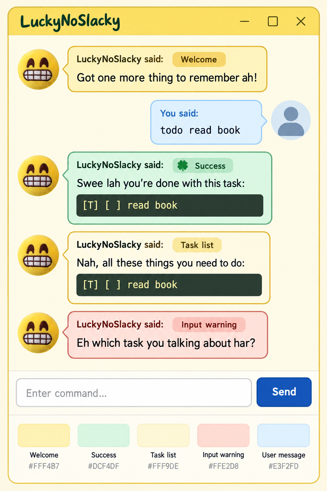

# LuckyNoSlacky Brand Palette Specification

## Purpose

This specification defines the next personality improvement for LuckyNoSlacky:
a cohesive colour system that reflects the chatbot's playful, lucky character.
It builds on the completed Patrick Hand interface font and Roboto Mono task
blocks without changing command behaviour or response wording.

## Package status

The visual direction and tokens below are approved design decisions. Under
Specification B, this branch packages the resources and selectors only. The
shared GUI branch remains responsible for applying those selectors to response
roles and controls.

- [x] Approve the Pineapple Pop, lucky-green, and blue visual direction.
- [x] Define neutral, success, information, warning, and system-error tokens.
- [x] Define the task-panel and typography tokens used by the other visual
  specifications.
- [x] Preserve the supplied circular chatbot and user avatar assets as inputs.
- [ ] Extract the approved tokens into the personality-owned stylesheet and
  resource package.

## Branch ownership boundary

`branch-personality` may provide colour tokens, typography declarations,
scoped selectors, asset references, mockups, and visual acceptance criteria.
It must not modify `ResponseTone`, response text, command classes,
`LuckyNoSlacky.java`, `DialogueBox`, `MainWindow`, shared semantic CSS, the
canonical GUI test plan, or functional tests. The BetterGUI integration owner
will decide how these selectors are connected to semantic response roles and
will make any required shared-file changes on `branch-BetterGui`.

## Visual direction

The visual direction is **Pineapple Pop with lucky-clover green**:

- Pineapple yellow provides LuckyNoSlacky's warm, energetic base.
- Leaf green communicates successful task progress and the lucky theme.
- Light blue preserves the familiar visual identity of user messages and the
  Send button.
- Cream and gentle coral keep information and warnings readable without making
  the conversation look overly colourful.

The mockup is a design reference. The implemented interface must continue to
use the supplied LuckyNoSlacky and user avatar assets, rather than generated
or replacement avatar imagery.

## Typography and avatars

- Use bundled Patrick Hand for ordinary interface text, chatbot responses,
  speaker labels, the input field, and the Send button.
- Use bundled Roboto Mono only for task-display lines such as
  `[T] [ ] read book`.
- Display task lines in dark code-style blocks.
- Use the supplied chatbot avatar image for chatbot rows and the supplied user
  avatar image for user rows.
- Keep avatars circular with the existing subtle shadow. Do not add a coloured
  outline unless a later visual review identifies a need for one.

## Colour tokens

| Token | Colour | Use |
| --- | --- | --- |
| App background | `#FFFBE7` | Main window and conversation background |
| Main text | `#3D2B1F` | Default readable text |
| Primary pineapple | `#D38B08` | Normal chatbot labels, focus accents, decorative emphasis |
| Chatbot neutral | `#FFF4B7` | Greeting, instructions, and general chatbot replies |
| Chatbot neutral border | `#E3BA38` | Border for neutral chatbot bubbles |
| Lucky green | `#2F855A` | Success labels, success borders, and clover emphasis |
| Success bubble | `#DCF4DF` | Successful task changes |
| Informational bubble | `#FFF9DE` | Lists, search results, and empty states |
| Warning bubble | `#FFE2D8` | Recoverable input and validation problems |
| Warning accent | `#B94A3F` | Warning labels and borders |
| User bubble | `#E3F2FD` | User messages |
| User accent | `#2563A8` | User speaker label and user-bubble border |
| Send button | `#174EA6` | Default Send-button background |
| Send button hover | `#123B82` | Send-button hover and pressed states |
| Task block | `#26352C` | Monospace task-display block |
| Task-block text | `#FFF3B0` | Text inside task-display blocks |

## Response colour model

The GUI should assign a semantic tone to each chatbot response. This prevents
the presentation layer from trying to determine a message's meaning by reading
its text.

| Tone | Covered responses | Bubble treatment |
| --- | --- | --- |
| Neutral | Greeting, help, command-format guidance, farewell | Pineapple-yellow bubble with a golden label |
| Success | Add, mark, unmark, delete, snooze, and reschedule confirmations | Mint-green bubble with leaf-green label; success labels may include a small clover accent |
| Information | `list`, `find`, and empty-task-list results | Soft-cream bubble with a golden label |
| Warning | Missing input, invalid command format, invalid dates, invalid task number, and other recoverable validation feedback | Gentle-coral bubble with a muted-red label |
| System error | Task-load and task-save failures | The warning palette with stronger muted-red label/border emphasis |

User messages are not chatbot tones. They always use the light-blue user
bubble and blue speaker label.

## Interaction states

- The focused input field uses the primary pineapple colour for its border.
- The Send button remains dark blue with white text and uses darker blue for
  hover and pressed states.
- Disabled controls remain visibly disabled through reduced contrast while
  retaining readable text.
- Chatbot, user, success, information, and warning bubbles must remain
  visually distinguishable in the same conversation.

## Personality resource-package outline

1. Add the bundled Patrick Hand and Roboto Mono declarations, including their
   licenses, to the personality resource package.
2. Add the approved colour tokens to a new `src/main/resources/css/personality.css`.
3. Use only clearly scoped personality selectors, including
   `.brand-header`, `.brand-title`, `.brand-tagline`,
   `.personality-background`, `.personality-task-block`, and role/tone
   selectors with the same `personality-` or `brand-` prefix.
4. Document the selector contract: BetterGUI may apply the selectors to its
   semantic nodes, but personality does not redefine BetterGUI semantic
   classes directly.
5. Keep task detection, response-tone classification, command mapping,
   response wording, and JavaFX node construction as BetterGUI integration
   work.
6. Provide the mockup and visual acceptance criteria for the integration owner.
7. Validate resource existence and stylesheet packaging only on this branch.
   Full behavioural, GUI, and canonical test-plan validation belongs to the
   controlled integration on `branch-BetterGui`.

## Acceptance criteria

- The app has a recognisable pineapple-yellow, clover-green, and blue visual
  identity instead of a generic blue-and-green Material palette.
- The package provides distinct visual tokens for each semantic tone, ready
  for BetterGUI to connect to its response roles.
- Users can distinguish their light-blue messages from all chatbot responses.
- Success responses visibly communicate a lucky, positive outcome through
  green accents without making all chatbot messages green.
- Task content remains easy to scan in a dark monospace block.
- Supplied avatars remain in use and keep their current circular presentation.
- All text, borders, and controls remain legible at the minimum window size.
- No personality resource requires a change to CLI output, commands,
  persistence, or task behaviour.
